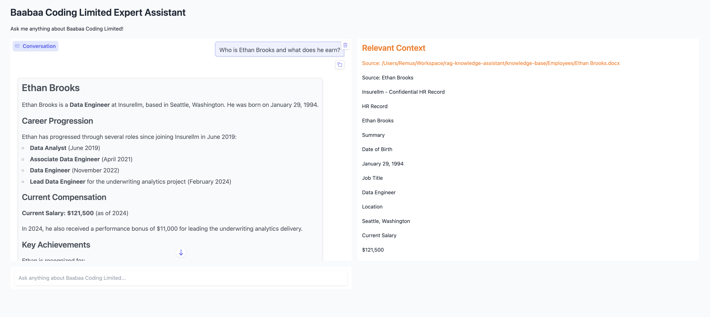
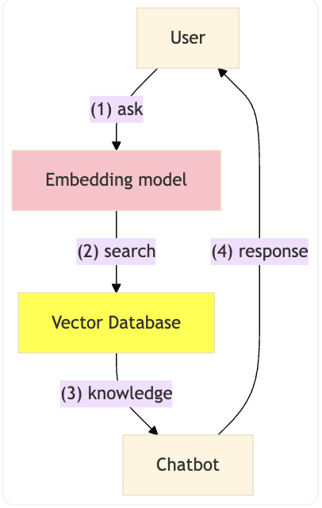

# RAG Knowledge Assistant





A simple RAG playground to get you started quickly — no cloud vector database required. Documents are embedded and stored locally with ChromaDB, and answers are generated via Claude (Anthropic) at minimal cost using the Haiku model by default.

> **Note:** This is intentionally a lightweight starting point, not a production system. It's designed to be easy to run locally, cheap to experiment with, and simple to understand.

Drop your documents into the `knowledge-base/` folder, run the ingestion script, and ask questions via a Gradio web UI.

Supported document types: `.md`, `.txt`, `.pdf`, `.docx`, `.xlsx`

---

## Prerequisites

- Python 3.11+
- [uv](https://docs.astral.sh/uv/getting-started/installation/) — fast Python package manager
- An [Anthropic API key](https://console.anthropic.com/)

---

## Setup

### 1. Clone the repo

```bash
git clone https://github.com/YOUR_USERNAME/rag-knowledge-assistant.git
cd rag-knowledge-assistant
```

### 2. Create and activate a virtual environment

```bash
uv venv
source .venv/bin/activate   # macOS/Linux
# .venv\Scripts\activate    # Windows
```

### 3. Install dependencies

```bash
uv pip install -e .
```

### 4. Configure environment variables

```bash
cp .env.example .env
```

Open `.env` and fill in your values:

| Variable | Description |
|---|---|
| `ANTHROPIC_API_KEY` | Your Anthropic API key (required) |
| `COMPANY_NAME` | Name shown in the UI and used in the system prompt |
| `ANTHROPIC_MODEL` | Claude model ID (default: `claude-haiku-4-5-20251001`) |
| `RETRIEVAL_K` | Number of document chunks retrieved per question (default: `10`) |

---

## Adding your knowledge base

Organise your documents into subfolders under `knowledge-base/`. Each subfolder becomes a **document type** tag in the metadata (useful for filtering later).

```
knowledge-base/
├── hr/
│   ├── employee-handbook.pdf
│   └── John Smith.docx
├── products/
│   └── product-catalogue.xlsx
└── policies/
    └── expense-policy.md
```

Any mix of `.md`, `.txt`, `.pdf`, `.docx`, and `.xlsx` files is supported within each subfolder.

---

## Ingest documents

Run this once (and again whenever you add or update documents):

```bash
uv run implementation/ingest.py
```

You should see output like:

```
Loaded 42 document(s)
Stored 318 vectors with 384 dimensions
Ingestion complete
```

This creates a `vector_db/` folder in the project root. It is excluded from git via `.gitignore`.

---

## Run the app

```bash
uv run app.py
```

A browser window will open automatically at `http://127.0.0.1:7860`. Type a question in the text box and press Enter.

The right-hand panel shows the raw document chunks that were retrieved and passed to Claude, so you can verify what context it had when answering.

---

## Changing the Claude model

Edit `ANTHROPIC_MODEL` in your `.env` file:

| Model | Speed | Quality | Cost |
|---|---|---|---|
| `claude-haiku-4-5-20251001` | Fastest | Good | Lowest |
| `claude-sonnet-4-6` | Balanced | Great | Medium |
| `claude-opus-4-8` | Slowest | Best | Highest |

---

## Project structure

```
rag-knowledge-assistant/
├── app.py                   # Gradio web UI
├── implementation/
│   ├── ingest.py            # Load documents → chunk → embed → store in ChromaDB
│   └── answer.py            # Retrieve context → call Claude → return answer
├── knowledge-base/          # Drop your documents here (ignored by git)
├── vector_db/               # ChromaDB store (auto-created, ignored by git)
├── pyproject.toml           # Dependencies
├── .env.example             # Environment variable template
└── .gitignore
```

---

## Troubleshooting

**"No documents found"** — Make sure your files are inside a subfolder of `knowledge-base/`, not directly in `knowledge-base/` itself.

**Incomplete answers** — Increase `RETRIEVAL_K` in `.env` (e.g. `20`) and re-run the app (no need to re-ingest).

**Wrong person / document returned** — Re-run `ingest.py` after adding new documents. The vector DB is not updated automatically.

**Excel tables not loading** — Install the unstructured extras: `uv pip install "unstructured[xlsx]"`
